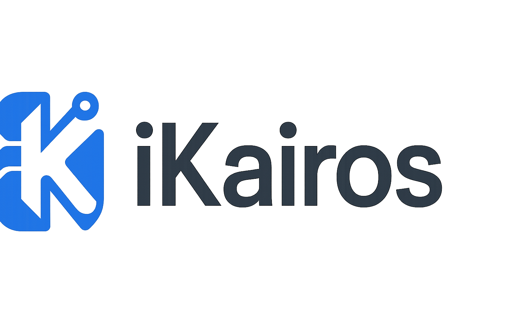

# iKairos - Asistente de IA Personal

iKairos es un asistente de IA personal para iOS y Android desarrollado con Flutter. Permite mantener conversaciones con una inteligencia artificial con personalidad ajustable mediante parámetros configurables.

<p align="center">
  
</p>

## Características principales

- **Chat interactivo** con una IA basada en Gemma 3 (12B)
- **Soporte para Markdown** en las respuestas, incluyendo resaltado de sintaxis para código
- **Temas claro y oscuro** totalmente personalizados
- **Parámetros de personalidad ajustables** mediante comandos (Sarcasmo, Entusiasmo, Formalidad, etc.)
- **Persistencia entre sesiones** para guardar y cargar conversaciones
- **Interfaz sencilla e intuitiva** optimizada para dispositivos móviles

## Configuración

### Prerrequisitos

- Flutter SDK (3.7.2 o superior)
- iOS 12.0+ / Android 5.0+
- Una cuenta en OpenWebUI o acceso a una API compatible

### Variables de entorno

Para ejecutar este proyecto, crea un archivo `.env` en la raíz del proyecto con la siguiente estructura:

```
API_BASE_URL=https://tu-api-url.com
API_TOKEN=tu-token-api
AI_MODEL=gemma3:12b
SYSTEM_PROMPT_TEMPLATE=Tu plantilla de sistema aquí
```

**Nota importante**: El archivo `.env` contiene información sensible y está configurado para ser ignorado por Git. Nunca subas tus credenciales al repositorio.

## Instalación

1. Clona este repositorio
   ```
   git clone https://github.com/tu-usuario/ikairos.git
   ```

2. Instala las dependencias
   ```
   cd ikairos
   flutter pub get
   ```

3. Crea y configura tu archivo `.env` siguiendo las instrucciones anteriores

4. Ejecuta la aplicación
   ```
   flutter run
   ```

## Uso

### Comandos principales

- `/parametros [Parámetro] [Valor]` - Ajusta un parámetro de personalidad (valor entre 0.0 y 1.0)
  - Ejemplo: `/parametros Sarcasmo 0.8`

### Parámetros disponibles

- **Sarcasmo**: Nivel de ironía y sarcasmo en las respuestas
- **Entusiasmo**: Energía y emoción en el tono de comunicación
- **Formalidad**: Uso de lenguaje formal vs. coloquial
- **Humor**: Tendencia a incluir elementos humorísticos
- **Empatía**: Nivel de comprensión y conexión emocional

## Licencia

Este proyecto está licenciado bajo la Licencia MIT - consulta el archivo LICENSE para más detalles.

## Créditos

Desarrollado por Alejandro Sánchez - © 2025
